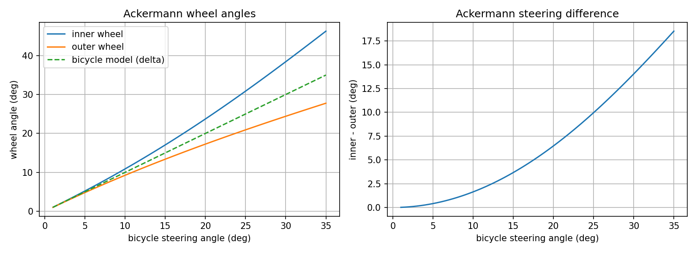

# Bicycle Gym: Autonomous Vehicle Control (ROS 2 Humble)

**Autotronics Research Lab (ARL), Ain Shams University**
Course: Autonomous Vehicles & Drive-by-Wire Systems | Individual Project


| | |
|---|---|
| **Repository** | https://github.com/FikryAdel/Fikry_Arab_Control_Task- |

---

## 1. Overview

A simulated self-driving car (extended kinematic bicycle model) drives around a closed 528.2 m racetrack in ROS 2. Velocity is a **state**, not an input: the car accelerates through throttle, drag and rolling resistance, so the controllers must handle powertrain lag and the coupling between speed and steering.

Implemented: the vehicle physics, a keyboard teleoperation bridge, a longitudinal PID cruise controller, a curvature-based velocity profiler, three lateral controllers (Lateral PID, Pure Pursuit, MPC), and a lap analyzer with live telemetry and RViz overlays.

## 2. System Architecture

```
                    /path (nav_msgs/Path)
   path_gen  ───────────────┬──────────────────────┐
                            ▼                      ▼
  /state (Odometry)   ┌────────────┐          lap_analyzer ──► /telemetry/*, /lap/metrics,
  ┌──────────────────►│ controller │                           /lap/visualization (RViz)
  │                   │  (2-tier)  │
  │                   └─────┬──────┘
  │       /throttle [-1,1]  │  /steer [rad]
  │                         ▼
  └────────────────────  sim_node (Car)
```

| Package | Responsibility |
|---|---|
| `bicycle_sim` | Vehicle model (`bicycle_model.py`), simulator node, URDF/Xacro, RViz config |
| `bicycle_control` | Teleop bridge, longitudinal PID, velocity profiler, Lateral PID, Pure Pursuit, MPC, `controller_node` |
| `track_environment` | Track loading, path publishing, cones, lap analyzer |

**Two-tier control.** The high tier (velocity profiler + a lateral controller) decides *what speed* and *what steering angle*. The low tier (longitudinal PID) turns the target speed into throttle/brake. In MPC mode the throttle comes from the MPC's optimal acceleration (`a_0 / k_a`).

**Vehicle parameters:** wheelbase L = 1.25 m, track width 1.18 m, wheel radius 0.5 m, `k_a` = 4.0 m/s², `c_drag` = 0.005, `c_roll` = 0.05, max steering 35°, max speed 25 m/s, simulation step dt = 0.1 s.

## 3. Mathematical Formulations

### 3.1 Extended kinematic bicycle model (M2)

State x = [x, y, θ, v], input u = [u_th, δ]:

```
ẋ = v cos θ
ẏ = v sin θ
θ̇ = (v / L) tan δ
v̇ = k_a · u_th − (c_drag · v² + c_roll · v)
```

Forward Euler: `x[k+1] = x[k] + ẋ · dt`, then
- **heading wrapping:** `θ = (θ + π) mod 2π − π`, so controllers never see a 2π jump in heading error;
- **speed clamping:** `v ∈ [0, v_max]`, so negative throttle only brakes and never reverses the car.

`tan δ` appears because the model puts the instantaneous center of rotation on the rear-axle line, giving turning radius `R = L / tan δ`.

### 3.2 Teleop bridge (M3)

```
throttle = clip(linear.x / max_linear_vel, −1, 1)
steer    = clip((angular.z / max_angular_vel) · max_steer, ±max_steer)
```
A **0.5 s watchdog** zeroes throttle, steering and the target speed if no `/cmd_vel` arrives, so the car never runs away if the keyboard connection drops.

### 3.3 Longitudinal PID with anti-windup (M4)

```
e = v_target − v
I ← clip(I + e·dt, −I_max, +I_max)       (anti-windup clamp)
u = kp·e + ki·I + kd·(e − e_prev)/dt,    u ∈ [−1, 1]
```
Without the clamp, a long acceleration phase would wind the integral up and cause a large overshoot. In teleop with `use_cruise_control:=true`, `linear.x` is treated as a *target speed*.

### 3.4 Velocity profiler (M5.1)

Lateral acceleration is `a_lat = v² |κ|`, so the curvature-limited speed is

```
v_max = sqrt(a_lat_max / |κ|),   v_target = min(v_max, v_limit)
```
For |κ| < 1e-4 the segment is treated as straight and `v_limit` is returned. Curvature is estimated as `κ ≈ Δψ / Δs` over neighbouring waypoints (with wrapped Δψ).

### 3.5 Lateral PID (M5.2)

Sign convention: CTE > 0 means the car is **left** of the path; heading error = ψ_vehicle − ψ_path.

```
δ = −(kp·cte + ki·∫cte + kd·d(cte)/dt) − k_yaw · ψ_err,    δ ∈ [−35°, 35°]
```
Both terms enter with a minus sign: a car left of the path, or pointing left of it, must steer right.

### 3.6 Pure Pursuit (M5.3)

```
L_d   = clip(k_v · v + l_min, l_min, l_max)            (adaptive look-ahead)
target = first waypoint ≥ L_d away from the car, searching forward from the nearest one
[x_l, y_l] = R(−ψ) · (target − position)                (vehicle frame)
α = atan2(y_l, x_l)
δ = atan2(2 L sin α, L_d)                               (arc law, κ = 2 sin α / L_d)
```

### 3.7 Extended kinematic MPC (M5.4)

Decision vector `u = [δ_0, a_0, …, δ_{N−1}, a_{N−1}]` with bounds δ ∈ ±35° and a ∈ ±k_a. The prediction model is the same extended bicycle model as in 3.1 (Euler, dt = 0.1 s), with v as an explicit state and a_k as its input.

Tracking error is projected into the **path-aligned Frenet frame** of reference point k:

```
e_long =  cos ψ_r · Δx + sin ψ_r · Δy
e_lat  = −sin ψ_r · Δx + cos ψ_r · Δy          (cross-track error)
e_ψ    = wrap(θ − ψ_r)
```

Cost:

```
J = Σ_k [ w_lat e_lat² + w_long e_long² + w_yaw e_ψ² + w_v (v − v_ref)²
          + w_steer δ² + w_dsteer (δ − δ_prev)² + w_accel a² ]
```

It is solved each cycle with SciPy SLSQP (receding horizon: only the first control is applied), **warm-started** with the previous solution shifted by one step. Final settings: N = 12, maxiter = 50, ftol = 1e-4, weights `w_lat=20, w_long=0.1, w_yaw=5, w_v=3, w_steer=0.1, w_dsteer=15, w_accel=0.05`. Measured solve time was about 7 to 25 ms at N = 8 (before raising N to 12), and the final controller was verified to publish at 10.0 Hz, inside the 100 ms control period. The reference speed follows the same curvature profile as the other controllers, so the comparison is fair.

### 3.8 Lap analyzer (M5.5)

Each state sample is projected onto the nearest path segment to get arc length `s`, signed CTE and heading error. A lap is counted when `s` wraps from the last quarter of the track to the first quarter (with sub-tick interpolation of the crossing time). Per lap it reports mean, RMS and max |CTE|, mean and max speed, and lap time.

Published topics: `/telemetry/cte`, `/telemetry/speed`, `/telemetry/heading_err_deg`, `/telemetry/lap_time`, JSON on `/lap/metrics`, and RViz markers on `/lap/visualization` (green-to-red CTE whisker and a floating HUD with lap, time, speed, CTE, best lap).

## 4. Benchmark Results

All values come from the lap analyzer's `OVERALL` line. Track: `centerline_0.csv`, 528.2 m closed loop, `target_speed` = 4 m/s base with curvature-limited profile (max 7.5 m/s).

| Controller Mode | Best Lap Time (s) | Top Speed (m/s) | Mean CTE (m) | Max CTE (m) | RMS CTE (m) | Laps Completed / Status |
|---|---|---|---|---|---|---|
| **Manual Teleoperation** | — | — | — | — | — | — |
| **Lateral PID (Reactive)** | 81.10 | 7.62 | 0.407 | 3.082 | 0.580 | 4 laps, completed |
| **Pure Pursuit (Preview)** | **71.99** | 7.41 | **0.042** | **0.383** | **0.064** | 4 laps, completed |
| **Extended Kinematic MPC (Optimal)** | 93.77 | 7.44 | 0.067 | 0.562 | 0.094 | 4 laps, completed |

Notes:
- Each controller ran 4 consecutive laps with identical code, parameters and machine; values are from the `OVERALL` line of the lap-4 banner.
- CTE statistics include the first lap, which starts from standstill.
- The Lateral PID peaks at 7.62 m/s, slightly above the profiler's 7.5 m/s cap; this is most likely overshoot of the longitudinal PID on straights due to powertrain lag.
- Mean speed per lap: Pure Pursuit about 6.15 m/s, Lateral PID about 5.95 m/s, MPC about 4.7 m/s.
- Lap times are very repeatable (Pure Pursuit 71.99 to 73.10 s, MPC 93.77 to 95.36 s, Lateral PID 81.10 to 82.33 s).
  
## 5. Critical Comparison

**Pure Pursuit** won on every metric. On this smooth track a look-ahead point that grows with speed gives preview, so the car enters corners correctly. It is also the simplest and cheapest to run, with one tuning knob (the look-ahead). Its weakness is that it is purely geometric: it ignores actuator limits and the speed profile, and can cut corners if the look-ahead is too large.

**Lateral PID** completed all laps but with roughly 10x the CTE of Pure Pursuit (0.407 m against 0.042 m mean) and a 3.08 m peak (a brief excursion off the centerline). With no preview, it reacts only after the error appears, and with steering and powertrain lag that becomes overshoot and oscillation at speed. It is also about 15% slower, since it drives a longer path (483.9 m in lap 1 against 445.2 m).

**MPC** tracked far better than the Lateral PID (mean CTE 0.067 m against 0.407 m, max 0.562 m against 3.08 m) but was the slowest (mean speed about 4.7 m/s). **This is not the behaviour theory predicts**: with a correct model, preview and constraints, MPC should match or beat Pure Pursuit. The controller loop itself is not the bottleneck: `ros2 topic hz /steer` showed 10.0 Hz (maximum period 131 ms), so the lower speed comes from the controller design rather than computation delay. Likely causes:
- the cost trades speed for smoothness (`w_dsteer` is large and `w_accel` penalises acceleration), so the optimizer prefers conservative speeds;
- the reference speed is evaluated only over a short horizon (about 1.2 s), so it brakes for corners early;
- SLSQP with a finite-difference gradient and a limited iteration count returns a partially converged solution;
- the kinematic model ignores tyre slip and steering/powertrain lag.

**Speed-weight experiment.** Doubling the speed weight (`w_v` from 3 to 6) gave a best lap of 91.30 s (about 2.6% faster than 93.77 s) with mean CTE 0.070 m (0.067 m before), over 3 laps. The gain is small, so the speed weight alone does not explain the gap to Pure Pursuit (71.99 s); the reported benchmark uses `w_v = 3`. Other experiments left for future work: lowering `w_dsteer`, a longer horizon, and a reference whose spacing does not depend on the current speed.

## 6. Why MPC Should Track Better Than Pure Pursuit and Lateral PID

- **Prediction over a horizon.** The Lateral PID sees only the instantaneous error. Pure Pursuit sees one point ahead and assumes a constant-curvature arc to it. MPC simulates the actual vehicle dynamics over N steps and optimizes the whole future trajectory, so it can start turning or braking before a corner and balances several corners at once.
- **Constraints inside the optimization.** Steering and acceleration limits are bounds in the problem, so the plan is feasible by construction. PID and Pure Pursuit compute an unconstrained command and saturate it afterwards, which breaks their own assumptions (and winds up the integral).
- **Joint speed and steering.** Speed is a state, so MPC accounts for how speed changes the yaw rate (`θ̇ = v tan δ / L`) and plans acceleration together with steering. The other controllers regulate speed separately and ignore the coupling.
- **Explicit smoothness.** The slew-rate term `w_dsteer (δ − δ_prev)²` penalises abrupt steering and makes actuator behaviour predictable.
- **Receding horizon feedback.** Re-solving every cycle from the measured state gives feedback and robustness to model error.

The price is computation: a nonlinear program must be solved at every control step. In our implementation that is acceptable (a few tens of ms), but it needs careful tuning, and a poorly weighted cost can easily lose to a simple geometric controller, as seen above.

## 7. Milestone 6: Four-Wheel Ackermann Kinematics

The bicycle model collapses the two front wheels into one. A real car's wheels must be perpendicular to the lines to a common instantaneous center of rotation (ICR) on the rear-axle line, otherwise they scrub. With L = 1.25 m and track W = 1.18 m, and turning radius `R = L / tan δ` at the rear-axle center:

```
δ_inner = atan( L / (R − W/2) )        δ_outer = atan( L / (R + W/2) )
cot δ_outer − cot δ_inner = W / L
v_inner = ω (R − W/2),  v_outer = ω (R + W/2),   ω = v / R
```

Script: `milestone6/ackermann_analysis.py` (output `ackermann_comparison.png`).

| δ (bicycle) | Inner | Outer | Difference | R (m) |
|---|---|---|---|---|
| 5° | 5.21° | 4.80° | 0.41° | 14.29 |
| 10° | 10.89° | 9.25° | 1.64° | 7.09 |
| 15° | 17.05° | 13.38° | 3.67° | 4.67 |
| 20° | 23.72° | 17.26° | 6.47° | 3.43 |
| 25° | 30.88° | 20.92° | 9.96° | 2.68 |
| 30° | 38.44° | 24.40° | 14.03° | 2.17 |
| 35° | 46.28° | 27.76° | 18.53° | 1.79 |

At v = 5 m/s and δ = 20°, the rear wheels run at 4.14 m/s (inner) and 5.86 m/s (outer), so a driven rear axle needs a differential.

**Findings.** The bicycle angle lies between the inner and outer wheel angles, which is why it is a good approximation. The inner-outer difference grows roughly quadratically with δ. On our track the commanded steering is mostly small, so the bicycle approximation is adequate for control, while the Ackermann geometry matters for tight corners, tyre wear and 3D/URDF accuracy.



## 8. Reproduction Guide

**Requirements:** Ubuntu 22.04 with ROS 2 Humble (WSL2 works), Python 3.10, numpy, scipy, matplotlib.

```bash
# Dependencies
sudo apt update && sudo apt install -y python3-colcon-common-extensions \
  python3-numpy python3-scipy ros-humble-robot-state-publisher \
  ros-humble-rviz2 ros-humble-xacro ros-humble-teleop-twist-keyboard \
  ros-humble-plotjuggler-ros ros-humble-rqt-plot

# Build
mkdir -p ~/ros2_ws/src && cd ~/ros2_ws/src
git clone https://github.com/FikryAdel/Fikry_Arab_Control_Task- Control_Project
cd ~/ros2_ws && colcon build --symlink-install
source install/setup.bash
```

**Run (one launch at a time):**

| Mode | Command |
|---|---|
| Base simulation | `ros2 launch bicycle_sim bicycle_sim.launch.py` |
| Teleop (+ cruise control) | `ros2 launch bicycle_sim bicycle_sim.launch.py controller:=teleop use_cruise_control:=true` then `ros2 run teleop_twist_keyboard teleop_twist_keyboard` |
| Lateral PID | `ros2 launch bicycle_sim bicycle_sim.launch.py controller:=lateral_pid` |
| Pure Pursuit | `ros2 launch bicycle_sim bicycle_sim.launch.py controller:=pure_pursuit` |
| MPC | `ros2 launch bicycle_sim bicycle_sim.launch.py controller:=mpc` |

**Telemetry:** `ros2 run rqt_plot rqt_plot /telemetry/cte /telemetry/speed` or `ros2 run plotjuggler plotjuggler`. The lap banner with all metrics is printed in the launch terminal after each lap.

**Tests:**
```bash
python3 -m pytest src/Control_Project/bicycle_sim/test/test_bicycle_model.py \
  src/Control_Project/bicycle_control/test -v
```

**Known issue:** `track_environment/test/test_track.py::test_json_track_is_rejected` fails because `track.py` raises `FileNotFoundError` before the CSV-extension check. This is in the provided code and does not affect the controllers.

## 9. Implementation Notes and Code Changes

### 9.1 Required implementations (the TODO blocks)

| Milestone | File | Function | What was implemented |
|---|---|---|---|
| 2 | `bicycle_sim/bicycle_sim/bicycle_model.py` | `update_x_dot` | Equations of motion (3.1) |
| 2 | same | `update_x` | Forward Euler, heading wrapping to [-pi, pi), speed clamp to [0, v_max] |
| 3 | `bicycle_control/bicycle_control/teleop_bridge.py` | `cmd_callback` | Open-loop Twist to throttle/steer mapping with clipping |
| 3 | same | `publish_commands` | 0.5 s safety watchdog and 10 Hz publishing |
| 4 | same | `__init__`, `odom_callback` | Cruise-control mode: `/state` subscription, PID, `use_cruise_control` switch |
| 4 | `bicycle_control/bicycle_control/longitudinal_pid.py` | `compute` | PID on speed error, integral anti-windup clamp, output saturation |
| 5.1 | `bicycle_control/bicycle_control/velocity_profiler.py` | `compute_target_speed` | Curvature-limited speed `sqrt(a_lat/abs(k))`, clamped |
| 5.2 | `bicycle_control/bicycle_control/lateral_pid.py` | `compute_steering` | PID on CTE plus heading term, negative-sign convention, anti-windup, saturation |
| 5.3 | `bicycle_control/bicycle_control/pure_pursuit.py` | `compute_lookahead`, `find_target_waypoint`, `compute_steering` | Adaptive look-ahead, forward waypoint search on the closed loop, arc law |
| 5.4 | `bicycle_control/bicycle_control/mpc.py` | `solve` | Prediction model, Frenet-frame cost, bounds, warm start, SLSQP |
| 5.5 | `track_environment/track_environment/lap_analyzer.py` | `record_lap_completion` | Per-lap mean/RMS/max CTE and speed stats, console banner, buffer reset |
| 5.5 | same | `publish_telemetry` | `/telemetry/*` Float32 topics and JSON on `/lap/metrics` |
| 5.5 | same | `publish_rviz_markers` | CTE whisker (green to red) and floating HUD |

### 9.2 Additional modifications to provided code

**`bicycle_control/bicycle_control/controller_node.py`**
- `import time` and a timing log in the MPC branch (`MPC solve: X ms`), used to check the solver keeps up with the 10 Hz loop (measured 7 to 25 ms).
- `self.mpc_horizon = 12` as a single source of truth for the horizon (previously 10 hard-coded in two places).
- New helper `curvature_at(idx)`; the Pure Pursuit branch now uses it instead of duplicated code (behaviour unchanged).
- `build_mpc_reference`: the reference speed now follows the same curvature-limited profile as the other controllers, so the comparison is fair (previously a constant `target_speed`).
- `get_waypoint_at_distance`: the reference yaw is now interpolated between waypoints instead of taking the previous waypoint's yaw, removing a small artificial heading error that caused needless steering corrections.

**`bicycle_control/bicycle_control/mpc.py`**
- Cost weights tuned: `w_lat=20, w_long=0.1, w_yaw=5, w_v=3, w_steer=0.1, w_dsteer=15, w_accel=0.05`.
- Solver options `maxiter=50`, `ftol=1e-4`.
- A `warnings.filterwarnings` line silences SciPy's harmless "outside bounds" warning (cosmetic).

### 9.3 New files

- `milestone6/ackermann_analysis.py`: Milestone 6 analysis script and plot.
- `README.md`: this document.

## 10. Source Files

`bicycle_sim/bicycle_sim/bicycle_model.py`, `bicycle_control/bicycle_control/teleop_bridge.py`, `longitudinal_pid.py`, `velocity_profiler.py`, `lateral_pid.py`, `pure_pursuit.py`, `mpc.py`, `controller_node.py`, `track_environment/track_environment/lap_analyzer.py`, `milestone6/ackermann_analysis.py`.
